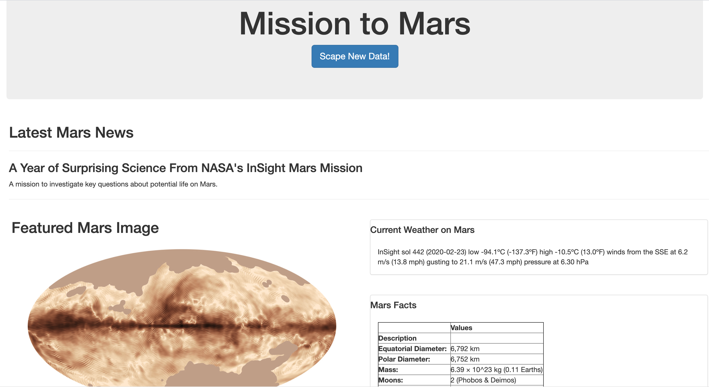
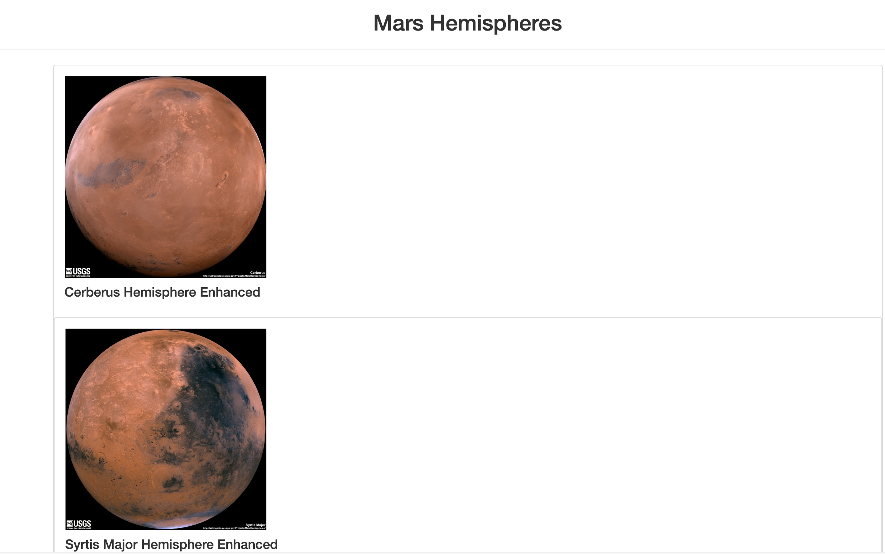
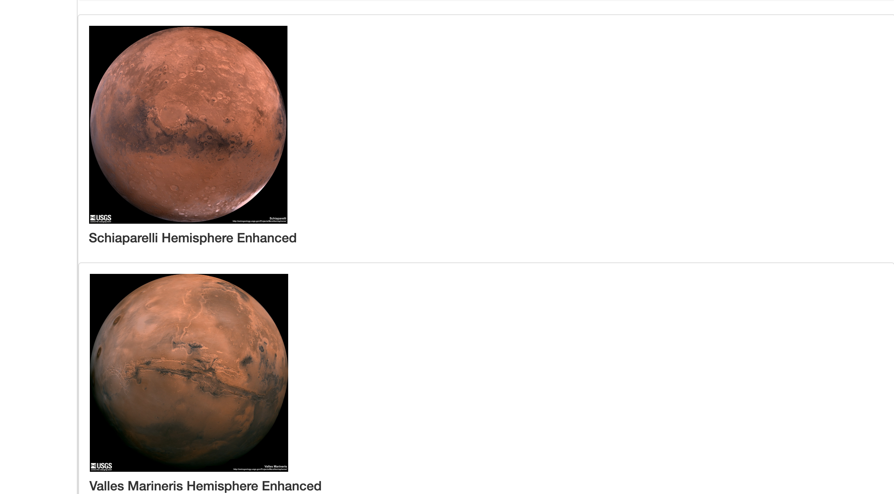

# Web Scraping Challenge - Mission to Mars

### Background - Web Scraping Challenge

In this challenge, I built a web application that scrapes various websites for data related to the Mission to Mars and displays the information in a single HTML page. In the Jupyter notebook, `mission_to_mars.ipynb`, I completed initial scraping using BeautifulSoup, Pandas, and Requests/Selenium. Then used MongoDB with Flask templating to create a new HTML page that displays all of the information that was scraped from the URLs below.

### Step 1 - Scraping

Furthermore, I scraped the [NASA Mars News Site](https://mars.nasa.gov/news/) to collect the latest News Title and Paragraph Text using BeautifulSoup. I scraped the featured image from [JPL Featured Space Image](https://www.jpl.nasa.gov/spaceimages/?search=&category=Mars) using Selenium and BeautifulSoup. I scraped the latest tweet and latest Mars weather report from the [Mars Weather Twitter](https://twitter.com/marswxreport?lang=en) using BeautifulSoup and Requests. Additionally, I scraped a table containing facts about the Diameter, Mass etc. from the [Mars Facts webpage](https://space-facts.com/mars/). Lastly, I scraped high resolution Mars' Hemispheres images from the [USGS Astrogeology site](https://astrogeology.usgs.gov/search/results?q=hemisphere+enhanced&k1=target&v1=Mars).

### Step 2 - MongoDB with Flask

- - 